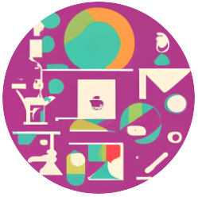

# PolicyRecon NLP Hackathon - Halıcıoğlu's Prodigies



This repo explores the ability to detect contradictions in government policy documents using natural language processing (NLP). The problem statement as posed in the PolicyRecon™ hackathon which inspired this repo is as follows:
> Given a collection of policy documents, identify contradictions (statement in one policy which are contradicted by another policy in the same group or org) within that collection

To quickly see results of the full pipeline in action, you may check out [`DoD Contradictions.ipynb (nbviewer)`](https://nbviewer.org/github/mlevitt-deloitte/Policy_Recon_HDSI/blob/main/DoD%20Contradictions.ipynb).

**Table of Contents**
- [Setup](#setup)
   - [Requirements](#requirements)
   - [Data](#data)
- [Detecting Contradictions](#detecting-contradictions)
   - [Run the full pipeline](#run-the-full-pipeline)
   - [Re-use or extend parts of the pipeline](#re-use-or-extend-parts-of-the-pipeline)
   - [Results](#results)
- [Developing](#developing)
   - [Use a local container image](#use-a-local-container-image)
   - [Install additional pip packages](#install-additional-pip-packages)
- [Troubleshooting](#troubleshooting)
- [Credits](#credits)
   - [Authors](#authors)
   - [References](#references)
   - [Acknowledgements](#acknowledgements)

## Setup

### Requirements
* [**Docker**](https://www.docker.com/)
   * We recommend using Docker as the fastest and most consistent method to deploy and develop this solution locally. You may install it using instructions here: https://docs.docker.com/get-docker/
   * We provide a Dockerfile and image which has all software requirements pre-installed.
* Otherwise, if you choose not to use Docker and you wish instead to run locally or in a compute environment such as Databricks, you must install [Python](https://www.python.org/) (we've tested versions 3.8 and 3.10) and install the packages from `requirements.txt`. You may find it helpful to create a virtual environment using [venv](https://docs.python.org/3/library/venv.html) if you are working locally.

### Data
Please download the datasets from the "PolicyRecon Analytics Challenge 2023" Team under `General > Files > 02. Data Sets` and save them to a directory `data/` within this repository. The directory structure should look like:
```
.
└── data/
    ├── Air Force Publications/
    ├── DoD Issuances/
    ├── FSIS/
    ├── NIFA/
    └── ... any additional datasets of your own
```
You may add your own datasets beneath the data directory!

## Detecting Contradictions
To detect contradictions, we utilize a pipeline that performs the following general steps:
1. Load documents.
2. Clean and split documents into chunks of sentences using a sliding window.
   * This allows us to inspect documents at a more granular level than the full text.
3. Use a transformer model to create chunk embeddings, then pre-select pairs of chunks that are the most similar.
   * This way we'll only look for contradictions between text which seems to be discussing the same concept based on surrounding context.
4. Apply a tokenizer + sequential classification model pre-trained for Natural Language Inference to all possible combinations of sentences between the two chunks for each pre-selected pair.
   * This model performs the heavy lifting of determining whether two sentences are contradictory.
5. Select the most contradictive sentence pairs and save the results, including the surrounding context (chunks) and the URLs of the documents being compared.

After running our pipeline, a csv is produced containing the top contradiction candidates and relevant information which enables human verification of the results much faster than if a human were to need to do all analysis manually.

This tool isn't meant to replace all human analysis, but rather to expedite the contradiction discovery process!

### Run the full pipeline
To run the full pipeline, you can execute `pipeline.py` as a script:
1. First edit `config.py` to specify your desired configuration variables
2. Launch `pipeline.py`
   1. You may use our provided utility target to run the pipeline from a Docker container on your machine.
      ```bash
      ./run.sh pipeline
      ```
   2. Or, from any system with the required environment installed (such as a Docker container or an active venv), run `python pipeline.py`.

> **Note**: The provided `config.py` uses demo values so that you can quickly run an example pipeline on a smaller chunk of data. It should take 5 minutes or less to run on a reasonably capable machine without GPU acceleration. Please modify the config values if you intend to run the pipeline on a full dataset!

### Re-use or extend parts of the pipeline
Under `src/` you can find all of the components used to build the contradiction discovery pipeline. Each module is well-documented regarding its contents and logic.

Because of the modular nature of our pipeline, you may modify, extend, remove, borrow, or replace the various components to best fit your use-case and dataset.

### Results
You may find results of the contradiction detection pipeline being ran on the full DoD Issuances dataset by inspecting [`DoD Contradictions.ipynb (nbviewer)`](https://nbviewer.org/github/mlevitt-deloitte/Policy_Recon_HDSI/blob/main/DoD%20Contradictions.ipynb). Outputs of the cells, including runtimes for long processes, are included in the notebook. (It is recommended you use the nbviewer link above to preserve output formatting online.)

## Developing
To develop with this solution, we recommend utilizing [Development Containers](https://containers.dev/) for consistency between developer systems and fast dependency installation. We define our dev container under `.devcontainer/`.

To work with our dev container in VSCode, use the following steps:
1. Install Docker on your system https://docs.docker.com/get-docker/
2. Install VSCode on your system https://code.visualstudio.com/download
3. Launch VSCode and open this folder as a workspace
4. Install the "Dev Containers" (ms-vscode-remote.remote-containers) extension from Microsoft
5. Click the pop-up window that says "Reopen in container" *[or]* use the command palette (<kbd>Ctrl/Cmd+Shift+P</kbd>) and search for then run the command "**Dev Containers: Reopen in Container**"

The window will then reload into a dev container, pull the image if this is your first time running, then allow you to execute code from within the Linux-based container mounted to this repository.

### Use a local container image
By default, the dev container will pull an image from a remote Docker Hub repository. You may replace this image by modifying the `.devcontainer/Dockerfile` and/or `requirements.txt` as you desire, then re-build the image and tag it to the expected name by running `make build-dev`.

Finally, run the VSCode command "**Dev Containers: Rebuild and Reopen in Container**" to reflect the image changes into the dev container.

### Install additional pip packages
1. Launch the dev container
2. Install the package via integrated terminal
3. Run `pip freeze | grep <packagename>` to find the version installed and add it to our requirements.txt file
4. Add any additional commands you had to run in the terminal (such as additional non-pip software dependencies that had to be installed) to our Dockerfile in a new RUN command
5. Run `make build-dev` to ensure the new requirements file passes without conflicts

## Troubleshooting
**Communication Errors**
* `huggingface_hub.utils._errors.LocalEntryNotFoundError: Connection error, and we cannot find the requested files in the cached path. Please try again or make sure your Internet connection is on.`
   * Remove the docker cache directory if you're using Docker, `rm -r .docker-cache`, then try again.
* `requests.exceptions.ConnectionError: HTTPSConnectionPool(host='cdn-lfs.huggingface.co', port=443): Read timed out.`
   * Try again. If this keeps happening when using Docker, it may be due to SSL certificate errors caused by Deloitte's netskope client injecting certificates in the middle of Docker's network requests. Consider using the SSL fix seen in [.devcontainer/Dockerfile](.devcontainer/Dockerfile) by manually adding Deloitte's netskope cert to the image.

## Credits

### Authors
Meet our team of four Halıcıoğlu Data Science Institute graduates who are now consulting at Deloitte. Our expertise ranges from machine learning to data visualization, and we are committed to staying at the forefront of machine learning research and are continuously expanding our knowledge by attending workshops, conferences, and collaborating with other data scientists.

<center>

| <br />Parker Addison | <br />Shweta Kumar | <br />Max Levitt | <br />Emily Ramond |
| :-: | :-: | :-: | :-: |

</center>

Please reach out if you would like more information!

### References
As part of our solution, we relied on the following helpful tools/models that we'd like to credit.
* [Haystack](https://haystack.deepset.ai/)
* [spaCy](https://spacy.io/)
* [HuggingFace](https://huggingface.co/)
* [Sentence-Transformers](https://www.sbert.net/)
* The model [`all-MiniLM-L6-v2`](https://huggingface.co/sentence-transformers/all-MiniLM-L6-v2) from sentence-transformers and based on the paper [*MiniLM: Deep Self-Attention Distillation for Task-Agnostic Compression of Pre-Trained Transformers*](https://arxiv.org/pdf/2002.10957.pdf) from Microsoft Research
* The model [`roberta-large-snli_mnli_fever_anli_R1_R2_R3-nli`](https://huggingface.co/ynie/roberta-large-snli_mnli_fever_anli_R1_R2_R3-nli) based on the paper [*Adversarial NLI: A New Benchmark for Natural Language Understanding*](https://arxiv.org/abs/1910.14599) by Yixin Nie et al. from UNC Chapel Hill and Facebook AI Research

### Acknowledgements
* This interesting project idea was originally created as a submission to Deloitte's **US GPS PolicyRecon™ NLP Hackathon**!
* We utilized the generous support of the Deloitte **Data Science Lab** team who provided us with a Databricks compute environment to run our pipeline. Thank you!
* The code for this project was originally hosted on GitHub at https://github.com/mlevitt-deloitte/Policy_Recon_HDSI/tree/main
